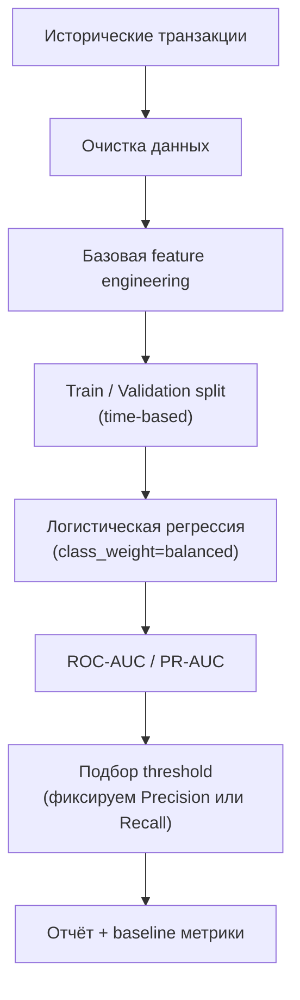
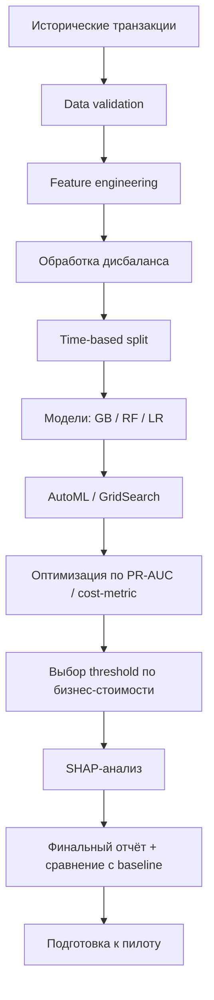

# ML System Design Doc — AutoML для обнаружения мошеннических транзакций

**AutoML-система обнаружения мошеннических транзакций AutoML Fraud Detection**

---

## 1. Цели и предпосылки

### 1.1 Зачем идём в разработку продукта

**Бизнес-цель:**

Проект направлен на создание автоматизированной системы выявления подозрительных операций, которая позволит эффективно управлять риском мошенничества в режиме реального времени, а также снизить финансовые потери банка от мошеннических транзакций при сохранении высокого уровня клиентского опыта.

**Почему станет лучше, чем сейчас, от использования ML**

Текущий типичный подход:
- Если сумма > 100 000 и ночь → флаг
- Если страна ≠ обычной → флаг
- Если 5 операций подряд в коротком интервале времени и к примеру одинаковая сумма операций → флаг

ML-модель учитывает сложные паттерны поведения, снижает ложные срабатывания, адаптируется к изменениям, гибкость порога риска (можно подстраивать threshold под бизнес-цель: допустимый уровень ложных срабатываний)

**Проблема:** 

Ручной подбор моделей, фичей и гиперпараметров для fraud detection требует значительного времени и экспертизы. AutoML позволяет ускорить разработку и стандартизировать процесс.

ML-модель учитывает десятки признаков одновременно, ловит нелинейные зависимости, видит комбинации факторов и адаптируется к новым паттернам. К примеру: cумма не большая, страна обычная, но сочетание времени + устройства + частоты операций необычно для конкретного клиента.

**Критерии успеха итерации:**

- Разработан полностью автоматизированный процесс оценки риска мошенничества, который можно регулярно использовать без ручного вмешательства.
- Модель достаточно точно выявляет мошеннические транзакции, чтобы уловить почти все потенциальные потери и при этом не блокировать слишком много нормальных операций.
- Подготовлен отчёт о работе модели, показывающий результаты экспериментов, ключевые факторы риска и рекомендации для дальнейшего внедрения.

---

### 1.2 Бизнес-требования и ограничения

**Основные бизнес-требования:**

1. Модель должна рассчитывать риск-скор транзакции в момент её проведения.
2. Система должна поддерживать настройку порога срабатывания.
3. Решение должно быть воспроизводимым и масштабируемым.
4. Должна быть возможность регулярного переобучения модели.

**Бизнес-ограничения:**

- Время отклика модели — не более N секунд (для онлайн-сценария).
- Ограниченный бюджет на вычислительные ресурсы.
- Необходимость объяснимости решений (регуляторные требования).
- Работа только с анонимизированными данными.
- Пилот запускается без изменения клиентского интерфейса.

**Ожидания от текущей итерации (MVP / Pilot)**

- Разработка и обучение AutoML-модели на исторических данных.
- Получение метрик качества на hold-out выборке.
- Оценка экономического эффекта.
- Подготовка отчёта для принятия решения о внедрении.

На данном этапе модель работает в offline-режиме (shadow-mode), без влияния на реальные транзакции.

**Описание бизнес-процесса пилота:**

*Текущий процесс (без ML):*
1. Транзакция проходит базовые проверки.
2. Rule-based система выставляет флаг.
3. Подозрительные операции направляются в антифрод-отдел.
4. Сотрудник принимает решение.

*Процесс в пилоте (shadow-mode):*
1. Транзакция проходит существующие проверки.
2. ML-модель параллельно рассчитывает риск-скор.
3. Скор записывается в лог.
4. После накопления данных проводится сравнение:
- какие операции модель пометила как рискованные,
- какие фактически оказались мошенничеством.

Модель не блокирует операции на этапе пилота.

*Потенциальный будущий процесс (после успешного пилота):*
1. Транзакция → ML-скоринг.
2. Если риск ниже порога → операция проводится.
3. Если риск средний → дополнительная аутентификация.
4. Если риск высокий → блокировка + ручная проверка.

**Критерии успешности пилота:**
- Recall мошеннических операций ≥ 80%.
- Precision ≥ установленного бизнес-порога (например, 50%).
- PR-AUC выше текущей rule-based системы.
- Модель демонстрирует экономически положительный эффект (снижение прогнозируемых потерь).
- Объём операций, направляемых на ручную проверку, не превышает операционные возможности отдела.
---

### 1.3 Скоуп проекта

**Что входит:**

- AutoML pipeline.
- Предобработка.
- Обработка дисбаланса классов.
- Поиск моделей.
- Подбор гиперпараметров.
- Сравнение моделей.
- Отчёт.

**Что не входит:**

- Production-интеграцию модели в транзакционный процесс.
- Реализацию API или микросервиса.
- Реализацию real-time инфраструктуры.
- UI/дашборды для антифрод-отдела.

**Результат с точки зрения качества кода и воспроизводимости:**

*- Артефакты:*
1. Jupyter notebook / Python-модуль с обучением.
2. Конфигурационный файл AutoML.
3. Зафиксированные random seeds.
4. Сохранённая финальная модель.
5. Pipeline предобработки.
6. Файл с метриками.
7. Документированный отчёт.

*- Воспроизводимость:*
1. Фиксированное разбиение данных.
2. Зафиксированные версии библиотек.
3. Сохранённые конфигурации гиперпараметров.
4. Возможность повторного запуска обучения.
5. Логирование экспериментов.

*-Требования к коду:*
1. Чёткое разделение этапов: data → preprocessing → training → evaluation.
2. Отсутствие утечек таргета.
3. Модульность (возможность заменить модель).
4. Минимизация hard-coded параметров.

---

### 1.4 Предпосылки решения

- Доступен размеченный датасет транзакций (fraud / not fraud)
- Есть вычислительные ресурсы для AutoML
- Данные анонимизированы
- Есть возможность построить train/test split

---

## 2. Методология

### 2.1 Постановка ML-задачи

Тип задачи: **бинарная классификация с сильным дисбалансом классов**.

Целевая переменная: fraud_flag ∈ {0,1}

*Особенности домена:*

- Сильный class imbalance (обычно 0.1–2% fraud)
- Высокая стоимость false negative
- Важны recall и PR-AUC

*Что делает модель:*

Модель рассчитывает вероятность мошенничества для каждой транзакции на основе:
- Параметров самой операции,
- Поведенческой истории клиента,
- Контекстных признаков.

Результат работы модели — числовой риск-скор (probability score).

*Формализация задачи*

Пусть:
X — вектор признаков транзакции,
y — бинарная метка мошенничества.

Необходимо построить функцию:
f(X)→P(fraud=1∣X)

---

### 2.2 Блок-схема решения

*Архитектура baseline:*

*Ключевые особенности baseline:*
- Без сложных поведенческих агрегатов.
- Без feature selection.
- Без cost-based оптимизации.
- Простая интерпретируемая модель.
- Получение отправной точки качества.

*Архитектура MVP:*

---

---

### 2.3 Этапы решения

### Этап 1 - Анализ и валидация данных

Проверки:

- Пропуски
- Типы признаков
- Выбросы
- Дисбаланс классов
- Дубликаты транзакций

Результат: отчёт EDA.

---

### Этап 2 - Подготовка прогнозных моделей

*Baseline*
Алгоритм
- Logistic Regression
- class_weight = balanced

*Метрики*
- ROC-AUC
- PR-AUC

*Результат baseline*
- ROC-AUC ≥ 0.70
- Документированный baseline-score
- Threshold для сравнения с MVP

*MVP*

Добавляем поведенческие признаки:
- Кол-во транзакций за 1ч / 24ч / 7д
- Средняя сумма клиента
- Recency (время с последней операции)
- Amount Ratio
- Hour — час транзакции
- Night Activity

*Модели*

- Gradient Boosting
- Random Forest
- Logistic Regression

*Метрики MVP*

- PR-AUC > baseline + 10%
- Recall ≥ 80% при Precision ≥ 40%
---

### Этап 3 - Интерпретация модели

- SHAP-анализ
- Проверка логики факторов с антифрод-отделом

*Product Owner подтверждает:*

- Модель учитывает разумные факторы
- Нет дискриминационных признаков
- Нет утечек

---

### Этап 4 - Интеграция бизнес-правил

*Добавляем rule-layer:*

- Лимит по сумме
- Blacklist
- Жесткие триггеры

*Сравниваем:*
- ML-only
- Rules-only
- Hybrid

---

### Этап 5 - Подготовка инференса

- Экспорт модели
- Описание входных фичей
- Документация API

---

### Этап 6 - Оптимизация threshold

Разработка cost-based оптимизатора. Подбираем threshold, минимизирующий суммарные издержки.
Total_Cost=FN∗Lossfraud​+FP∗Costreview​

---

### Этап 7 - Финальный отчет

- Сравнение baseline и MVP
- Экономический эффект
- Риски
- Рекомендации по продуктивизации

---

## 3. Подготовка пилота

### 3.1 Способ оценки пилота

Целью пилота является проверка снижения ML-модели совокупных потерь от мошенничества по сравнению с текущей rule-based системой при допустимом уровне ложных блокировок.

*Дизайн пилота*

- Этап 1. Shadow Mode (2–4 недели)

1. ML-модель рассчитывает скор для всех транзакций
2. Решения принимает текущая rule-based система
3. ML не влияет на реальные решения

Цель: убедиться в стабильности модели.

- Этап 2. Online A/B Test (4–8 недель)

Трафик делится случайным образом:
- Control (50%) — текущая система правил. Транзакции обрабатываются как обычно
- Test (50%) — ML + rules (hybrid). Транзакции срабатывают по ML-скорингу и проверяются правилами.
Рандомизация на уровне клиента или транзакции (предпочтительно — клиент, чтобы избежать пересечения сценариев).

*Метрики оценки*

Для online A/B test фиксируем ограниченный набор метрик:

1. **Основная бизнес-метрика: Fraud Loss Rate**
  Потери от подтверждённого мошенничества / общий оборот.
  Это главный критерий, потому что именно он напрямую отражает финансовый эффект антифрод-решения.

2. **False Decline Rate**
  Доля легитимных транзакций, ошибочно отклонённых или заблокированных.
  Метрика нужна, чтобы снижение fraud-loss не было достигнуто за счёт ухудшения клиентского опыта.

3. **Manual Review Rate**
  Доля транзакций, отправленных на ручную проверку.
  Метрика ограничивает рост операционной нагрузки на антифрод-команду.

---

### 3.2 Что считаем успешным пилотом

Пилот считается успешным, если одновременно выполняются следующие условия:

1. В тестовой группе наблюдается статистически значимое снижение `Fraud Loss Rate` относительно control:
   - p-value < 0.05;
   - относительное улучшение не ниже заранее согласованного бизнес-порога (например, `X%`).

2. `False Decline Rate` не растёт выше допустимого порога:
   - рост не более `Y%` относительно control;
   - либо абсолютное значение не превышает заранее согласованный SLA клиентского опыта.

3. `Manual Review Rate` остаётся в пределах операционной ёмкости:
   - прирост не превышает `Z%`;
   - антифрод-команда способна обработать дополнительный поток без ухудшения SLA.

---

### 3.3 Подготовка пилота

Ограничения по вычислительным ресурсам

*Baseline:*
- Модель: логистическая регрессия
- Время обучения: < 10 минут
- Используемая оперативная память: ≤ 8 ГБ
- Цель: быстрый расчёт метрик для отправной точки

*MVP:*
- Модели: Gradient Boosting, Random Forest
- Гиперпараметры моделей (Gradient Boosting, Random Forest) конфигурируются через файл config.yaml.
- Планируемое время обучения: 1–2 часа на историческом датасете (~1 млн транзакций)
- Ограничение: максимальная нагрузка на вычислительные ресурсы не должна превышать доступного кластера (CPU/GPU лимит)

---

## 4. Внедрение

### 4.1. Архитектура решения и отказоустойчивость

*Основные компоненты*
- Data Sources — транзакционные данные, пользовательские профили, исторические метки мошенничества
- Feature Engineering Layer - агрегации по пользователю (velocity, frequency), поведенческие признаки, признаки устройства и геолокации
- Model Layer - ML-модель (Gradient Boosting / Random Forest)
- Decision Engine - принимает решение на основе ML-скоринга и правил
- Monitoring & Logging - отслеживание метрик, логов, аномалий

*Нормальный поток обработки*
1) Offline pipeline (training):
  - сбор исторических транзакций
  - очистка и фильтрация данных
  - генерация признаков
  - разбиение:
      - train / validation / test (time-based split)
  - обучение модели на train-выборке
  - валидация на validation-выборке
  - выбор лучшей модели на основе метрик на валидации
2) Online pipeline (inference):
  - поступление транзакции в реальном времени
  - извлечение признаков (feature store / realtime aggregation)
  - расчёт ML-скора
  - применение правил
  - возврат решения

*Отказоустойчивость*
1) Ограничение по времени и повторы: если ML-инференс не укладывается в SLA (например, 100 ms), решение принимается через fallback — rule-based систему.
2) Мягкая деградация: при недоступности части данных (real-time features) используется упрощённый набор признаков или baseline-модель.
3) Защита от перегрузки: ресурсоёмкие операции (feature generation, batch scoring) выполняются асинхронно через очередь, чтобы не влиять на задуржку онлайн-сервиса.
4) DLQ (очередь ошибок): транзакции, которые не удалось обработать, отправляются в отдельную очередь для последующего анализа и повторной обработки.
5) Проверки здоровья: используются health-check’и и автоматическое исключение неработающих инстансов из балансировки.
6) Circuit Breaker: при росте ошибок ML-сервис временно отключается, а система автоматически переключается на fallback-логику.
7) Идемпотентность: повторная обработка одной и той же транзакции не приводит к дублированию решений или логов.
8) Мониторинг и алерты: система отслеживает задержку, error rate и availability, с автоматическими уведомлениями при деградации.

*Режимы деградации*
- Нехватка ресурсов или рост задержки -> более лёгкая модель (например, логистическая регрессия вместо бустинга).
- Real-time признаки недоступен -> используем batch/offline признаки или кэшированные значения.
- Недоступны внешние сервисы (гео или device data) -> решение принимается без этих данных.
- Перегрузка антифрод-команды -> повышается порог отправки на ручную проверку.
- Повторяющиеся или похожие транзакции -> используем ранее рассчитанные решения.

---

### 4.2. Инфраструктура и масштабирование

- Все сервисы развёрнуты в контейнерах (Docker) для обеспечения переносимости и быстрого масштабирования.
- Inference-сервис, feature generation и decision engine масштабируются независимо в зависимости от нагрузки.
- Наиболее ресурсоёмкие компоненты (feature processing и ML inference) масштабируются отдельно и приоритетно.
- Асинхронные процессы (логирование, обновление меток, batch-задачи) вынесены в очереди для разгрузки онлайн-контура.
- Релизы выполняются через canary deployment, что позволяет безопасно выкатывать изменения и быстро откатываться при проблемах.

---

### 4.3. Требования к работе системы

- SLO по доступности: не ниже `99.9%` в месяц для online scoring системы.
- SLO по задержке: `p95 < 100ms` на обработку транзакции (end-to-end, включая feature extraction и inference).
- SLO по задержке файлов: система должна выдерживать целевой поток транзакций (N TPS) без деградации задержки.
- SLO по качеству данных: задержка обновления признаков (feature freshness) не более заданного окна (например, ≤ 5 минут для near real-time фичей).
- Система должна корректно работать при пиковых нагрузках (например, кратный рост транзакций в периоды акций).
- Для инцидентов фиксируем:
  - `RTO` (время восстановления) ≤ 30 минут,
  - `RPO` (допустимая потеря данных/событий) ≤ 5 минут.
- При деградации системы:
  - Сохраняется возможность обработки транзакций (fallback на rules),
  - Задержка не выходит за критические пределы (например, `p95 < 200ms`),
  - Не происходит потери транзакций.
---

### 4.4. Безопасность системы

- Разграничение доступов: Data Scientist не имеет прямого доступа к продакшен-сервисам.
- Анонимизация данных: использование маскированных или агрегированных данных.
- Code Review и ML Review: все изменения проходят проверку перед внедрением.
- Версионирование: модели (model registry), данные, признаки.
- Изоляция сред: dev / staging / prod разделены по окружениям, эксперименты не влияют на прод.
- Мониторинг и аудит: логирование всех действий и доступов.

---

### 4.5. Безопасность данных

- Data Scientist использует только те признаки, которые необходимы для модели.
- Анонимизация и псевдонимизация:
  - удаление PII (имя, номер карты и т.д.)
  - использование хэшей или токенов
- Контроль доступа: доступ к данным ограничен ролями и задачами.
- Логирование и аудит: все обращения к данным фиксируются и могут быть проверены.
- Data retention policy: данные хранятся ограниченное время в соответствии с требованиями закона.
- Согласие пользователя и правовая база: обработка данных происходит на основании:
  - пользовательского согласия
  - или легитимного интереса (например, предотвращение мошенничества)
- Изоляция сред: Data Scientist работает с обезличенными данными в dev/staging среде.
- Проверка перед внедрением: новые признаки проходят проверку на наличие персональных данных.

---

### 4.6. Издержки

- Вычислительные ресурсы (inference): обработка транзакций в реальном времени.
- Обучение моделей (training): периодическое переобучение моделей на исторических данных.
- Хранение данных: транзакции, признаки, логи, модели.
- Очереди и инфраструктура: брокеры сообщений, оркестрация, балансировка нагрузки.
- Мониторинг и логирование: хранение метрик, алерты.